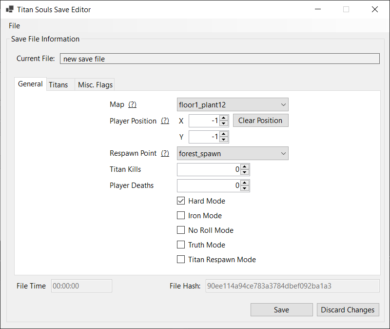

# TitanSoulsSaveEditor

- Create new save files.
- Edit existing save files.
- Set player position to any map at any coordinate.
- Toggle game modes.
- Toggle Titan deaths.
- Toggle miscellaneous flags (open doors, trigger switches).

# Structure
- The SaveParser project is for parsing the save file.
- The SaveEditor project is for launching the form to edit the save file.

# Screenshot
